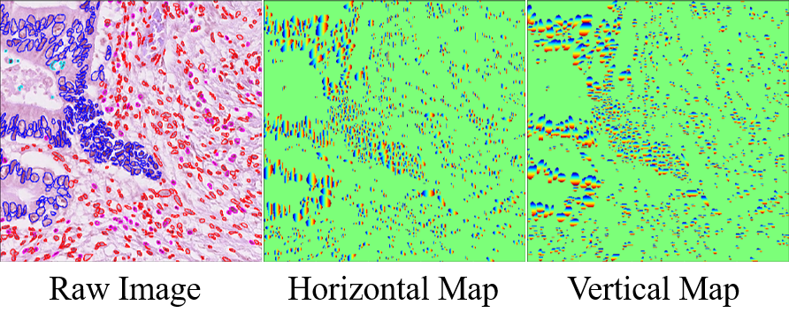
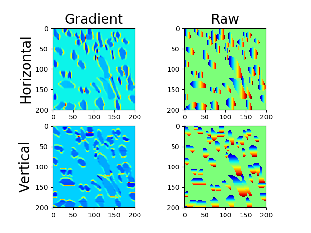
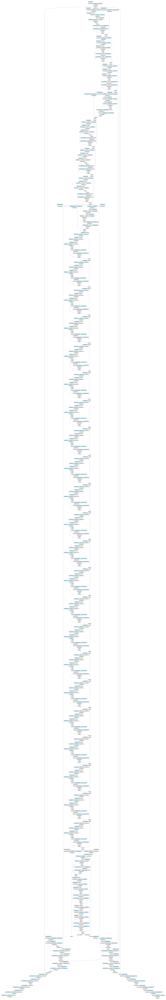

# Cell Instance Segmentation
This repo was constructed for cell instance segmentation.
1. run [horizontalVerticalMap.py](./horizontalVerticalMap.py) to save the horizontal and vertical maps.
2. run [train.py](./train.py) to train the model
3. run [inference.py](./inference.py) to inference
## Horizontal & Vertical Map
 
---

---
## Model
There are 2 branches consisting of horizontalVertical(MSE loss) and segmentation(Dice + CE)
- MSE loss: (l1)the loss of the horizontal and vertical map + (l2)the loss of the gradient of the horizontal and vertical map
- Dice loss: sementic segmentation output(l3)
- CE loss: sementic segmentation output(l4)

## Loss
Loss = l1 + 2 * l2 + l3 + l4
## Data Augmentation
_Don't use flip or rotation_
